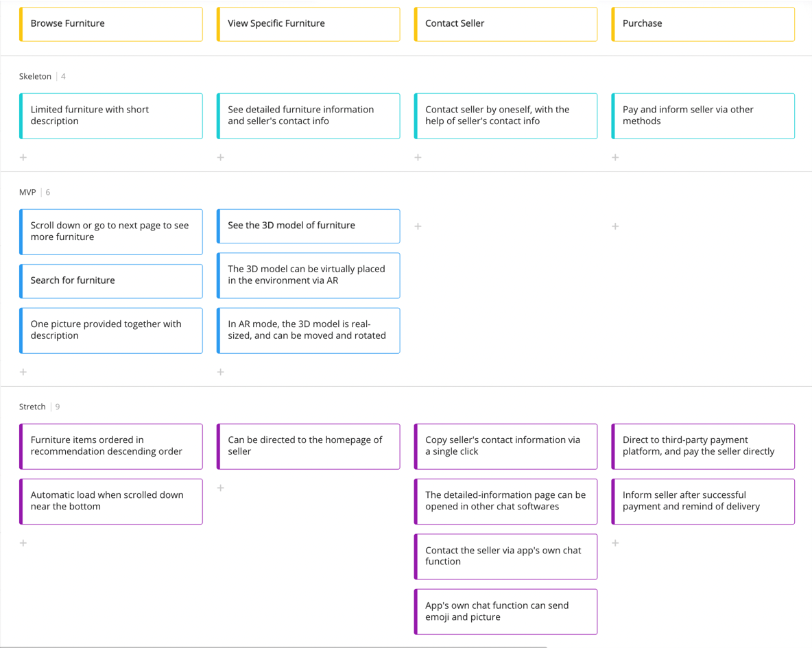
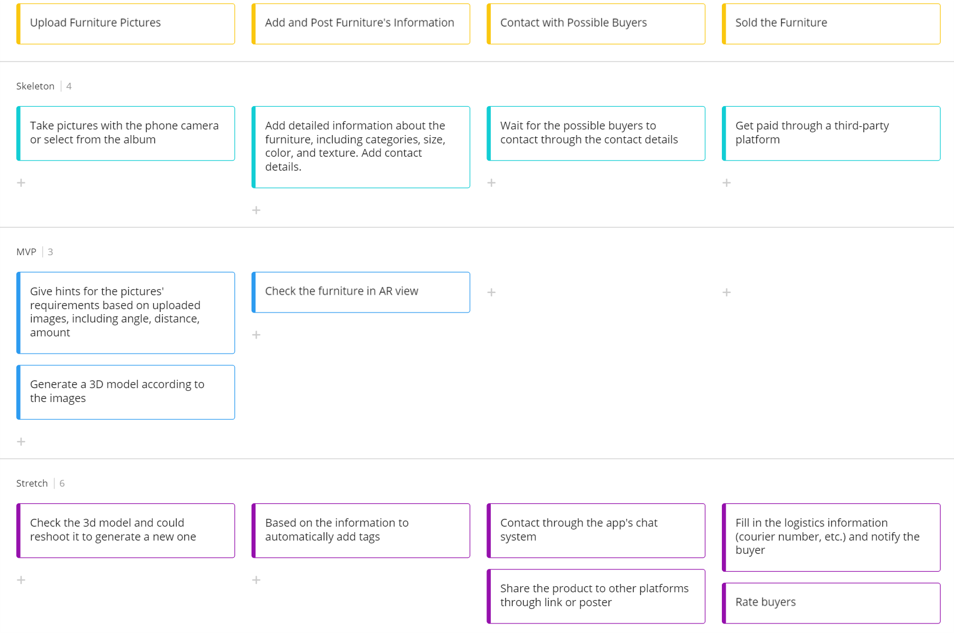
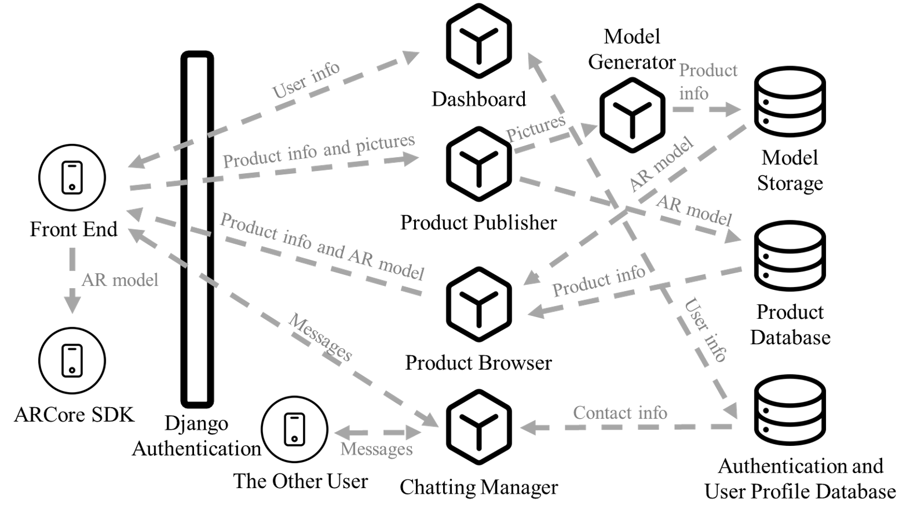
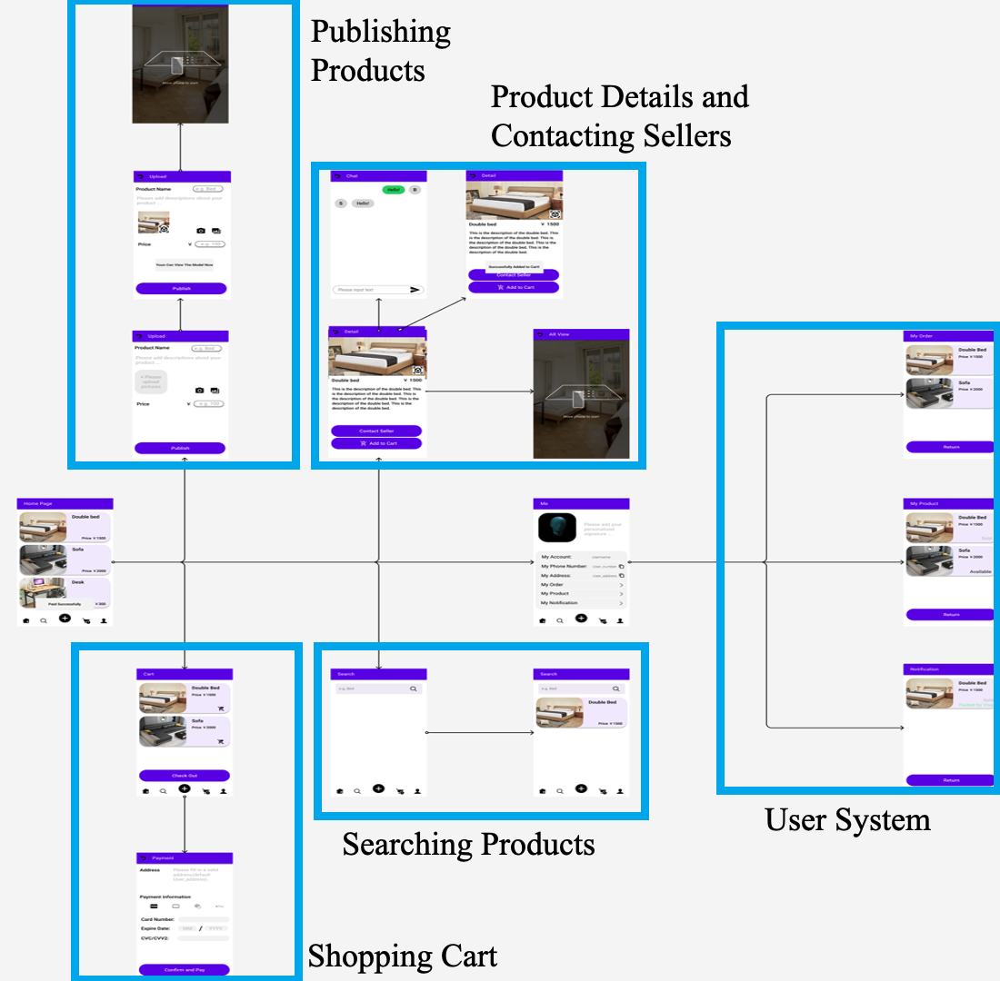
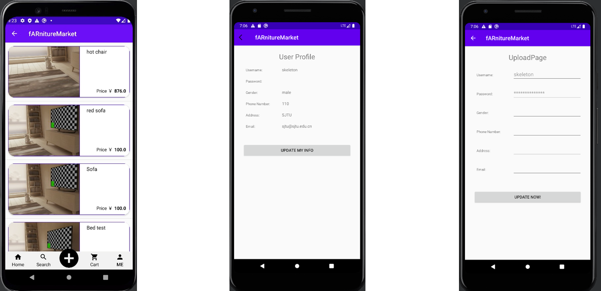
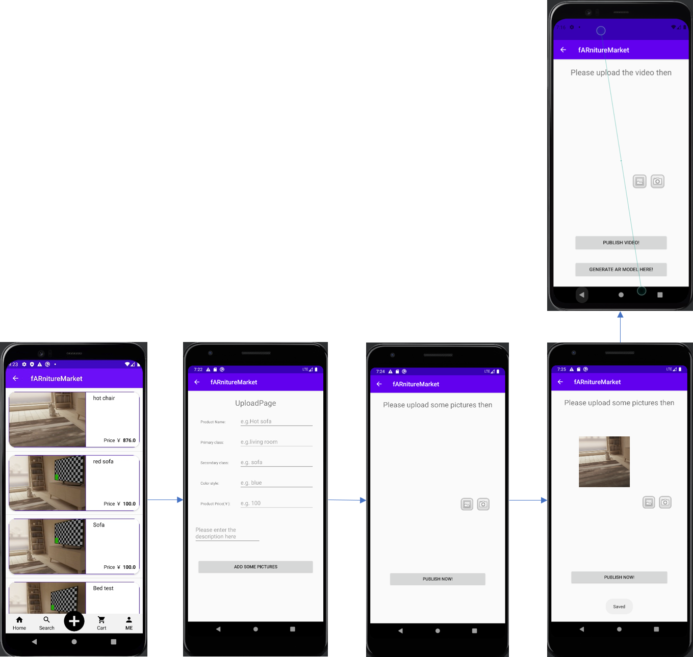
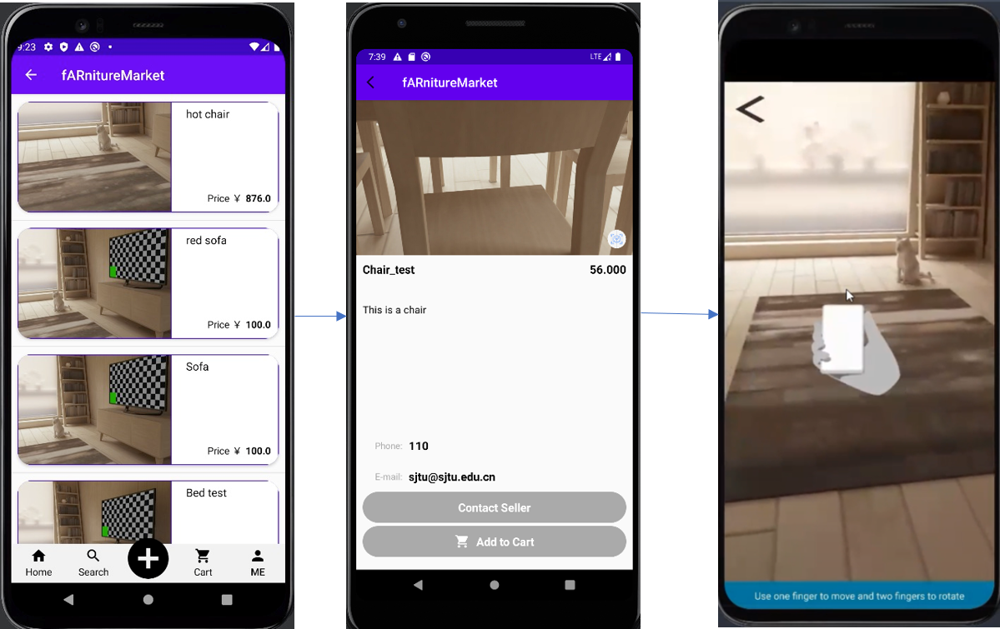
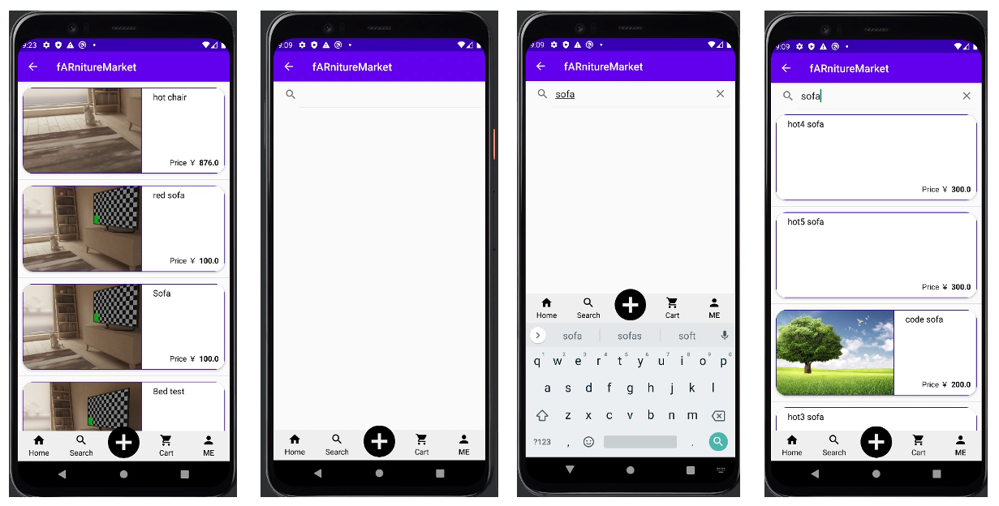
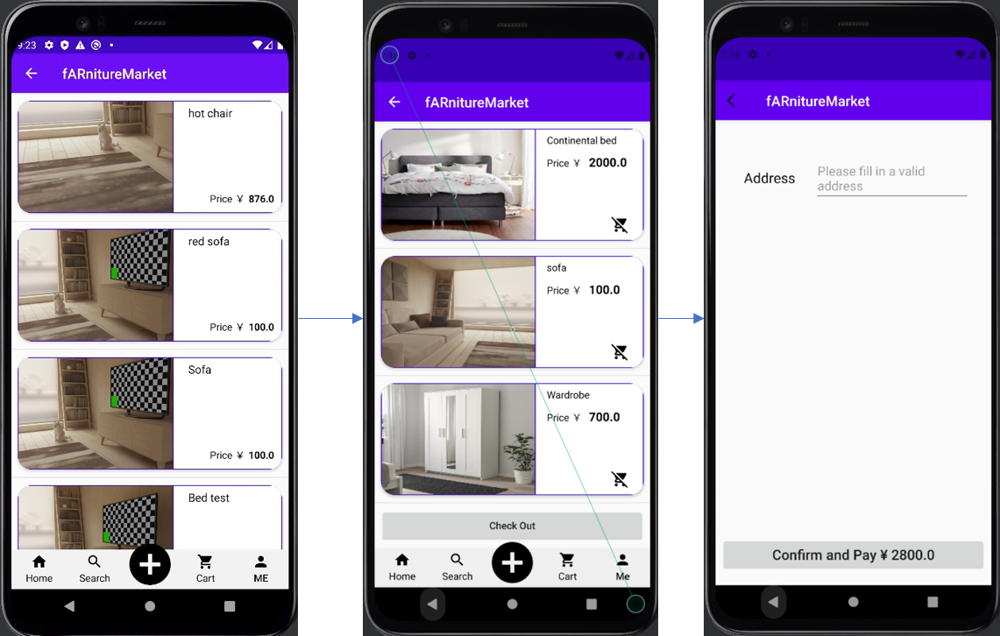

# AR-enabled-furniture-trading-plateform
Capstone project (VE441 App Dev for Entrepreneurs) for SJTU-UM Joint Institute

## Getting Started

Backend
- Django 4.0.4
- PostgreSQL 14.3
- Alipay SDK: python-alipay-sdk, install with [pip install python-alipay-sdk]. To set up the sandbox environment and get priavet and public keys, check https://open.alipay.com/

Frontend
- Android API level 30
- Andriod Studio
- ARCore SDK for Android 1.31.0
- OKHttp dependency for server communication
- Android Emulator Pixel 4 API 29 on Windows x86 platform (The app may not work properly on other emulators)

## Model and Engine

### Storymap

#### Buyers

#### Sellers

### Data and Control Blocks

The primary functional blocks of the app include AR, Publisher, Browser, Usersystem, Cart, Payment and Chatting.

User system. The user system provides a user the opportunity to register, log in, log out and delete his account. Users can also input, check and update his personal information on the system. Besides, our app relies on the user system to provide contact information between sellers and buyers. This system further lays the foundation for product ownership management and access control.

Product Browser is used to search for existing products. The front-end sends a GET request to Product Browser with reqired fields. If the request wants a specific product with its UID, all information about this product is fetched and sent back to the front-end. If the request wants some products that satisfiy the searching criterial, Product Browser sends 5-10 results that are wanted to the front-end. Front-end may indicate specific fields that should be returned in this case. All the product information not including the AR model is stored in one seperate Product Database that is not the same as User Profile Database. This database also includes the file location of the corresponding AR model. To require an AR model for a specific product, its UID will be provided by the front-end and Browser searches for the targeted file. All user will have browsing history stored, so that the front-end can request for user recommendation on the welcoming homepage without providing any additional information. Product Browser is connected and managing two parts of storage: basic product information database and AR model files.

Porduct Publisher is for buyers to publish new products. The front-end sends a POST request to the module including basic product information and pictures of the product from multiple angles. Product Publisher organizes, verifies and fills in the basic information and pushes updates to Product Database, and gives it a unique UID. In the meantime, Product Publisher passes on the materials needed to generate the AR model to the Model Generator. Model Generator processes the materials in an async way. When model generation (which will take some time) is done, Model Generator will inform the front-end so that the user may request for the AR model through Product Browser and do necessary adjustment (such as adding more angles for a better model). Product Publisher is also responsible for updating product information and AR models.

Chatting Manager supports establishing chats between buyers and sellers. After the buyer searches for a product and gets the owner's username, the front-end sends the username to Chatting Manager so that this module creates a chatting session between the buyer and the seller. Each side of the chatting session may choose to create/post chat/get chat/delete session.

Cart. The cart is used as shopping carts for users. Users can add products into their shopping cart and check out from there. Alipay SDK is used.

Payment. The payment system is used to pay for products. For now, it will provide a sandbox Alipay link which cannot be paid for real if the account does not have enough money remaining. The current system is simply a prototype, considering that real payment via Alipay requires examination and approval from Alibaba.

AR. The AR system is used to generate and display AR models of products. The model generation is based on the uploaded video, and the display of AR models is implemented using Android AR Core.The display of the AR model is done through ARCore SDK for Android which is handled by the front-end device.

## APIs and Controller

### User management

SERVER_IP/check/

Get the user's information. A GET request with a body containing the required fields. E.g., {"username":"", "gender":""}

SERVER_IP/update/

Update the user's information. A POST request with a body containing the required fields. E.g., {"username":"new_name", "gender":"male"}

SERVER_IP/login/

Try to log in a session with user name and password. E.g., {"username":"cky", "password":"1234567"}

SERVER_IP/register/

Try register a new user with user name and password. Additional fields may be provided. Otherwise, these fields will be default values. E.g., {"username":"cky", "password":"1234567", "address":"xxx"}

SERVER_IP/logout/

Log out.

SERVER_IP/delete/

Delete the current user.

### Browser

SERVER_IP/fetch_home_products/

Get at most 64 UID for homepage.

send: anything

receive: {"0": "13233412-34xewrcr", "1": "7645ytewerg-vewegf"}

SERVER_IP/fetch_searched_products/

Get at most 64 uids by searching.

send: {"keywords": "sofa big", "owner": "xingyanwan", "primary_class": "living room", "secondary_class": "sofa", "color_style": "blue", "price_gt": "100", "price_lt": "500", "starts_from": "128"}

starts_from: for example, if you have checked 64 results and want to see more results, set starts_from = 64

receive: {"0": "13233412-34xewrcr", "1": "7645ytewerg-vewegf"}

SERVER_IP/fetch_product_brief/

Get the brief info by UID.

send: {"UID": "afrtr-43gtwwf"}

receive: {"name": "good sofa", "description": "this is a sofa", "price": 200, "picture": "some url"}

picture is the url of the title page, the name of this picture is title.jpg in FS

SERVER_IP/fetch_product_detailed/

Get all the information except AR model, plus user contact information (added).

send: {"UID": "afrtr-43gtwwf"}

receive: {"UID": prod.id, "name": prod.name, "description": prod.description,
"owner": username, "primary_class": prod.primary_class,
"secondary_class": prod.secondary_class, "color_style": prod.color_style,
"price": prod.price, "sold_state": prod.sold_state,
"picture_0": url0, "picture_1": url1}

all pictures will be sent, test.jpg on FS will result in "test": some_url

primary_class is level-1 classification like kitchen, living room, bathroom; for recommendation and searching

secondary_class is level-2 classfication like sofa, chair; for recommendation and searching

### Publisher

SERVER_IP/post_product/

Post a product, without picture.

must login first with cookie in the request

send: {"name": prod.name, "description": prod.description, "primary_class": prod.primary_class,
"secondary_class": prod.secondary_class, "color_style": prod.color_style, "price": prod.price}

receive: HttpResponse starts with failed or {"UID": "tw5y65we3t4sdv"}

SERVER_IP/post_picture/

Post a picture.

must login first with cookie in the request, you must be the owner

send: {"UID": "wdefargstrdtyu", "picture": "pic_name", "image": img_file}

like lab2 request.FILES["image"] has the file

on FS, the new picture will be named as "pic_name.jpg"

name it "title" if you want it as the result picture in fetch_product_brief

if "pic_name.jpg" exists, it will be overwritten

SERVER_IP/delete_picture/

Delete a picture.

must login first with cookie in the request, you must be the owner
POST method

send: {"UID": "wdefargstrdtyu", "picture": "pic_name"}

SERVER_IP/update_product/

Refer to post_product, except UID must be provided.

SERVER_IP/delete_product/

Delete a product.

must login first with cookie in the request, you must be the owner

send: {"UID": "wdefargstrdtyu"}

### Chat

SERVER_IP/post_chat/

Post a chatting message.

Indicate "seller" or "buyer" in the sending message, and the other field will be your username.

send: {"seller":"wxy", "content":"hello"}

SERVER_IP/post_chat_picture/

Post a chatting picture.

send: {"buyer":"wxy"} and some picture

SERVER_IP/get_message/

Get chatting messages.

send: (optional body) {"last_idx":9}

"last_idx" means you do not want to fetch information from the beginning

receives: {"as_seller":{{"0":{"seller":wxy,"buyer":"cf","content":"hello","is_picture":"False"}}},as_buyer:{{"0":{"seller":cf,"buyer":"wxy","content":"hello2","is_picture":"False"}}}}

if is_picture, content will be picture url

### AR

SERVER_IP/get_ar_model/

Get the AR model of the product. Refer to SERVER_IP/fetch_product/. Returns the AR model is possible. Returns a failure response if not finding the product or no available AR model.

### Purchase

SERVER_IP/buy_product/

Try to buy the product. Send a GET request with a body including its UID. E.g., {"UID":"12323"} If the user account has enough money, it will be automatically paid. If not, an Alipay trade link is returned. Open it with web browser to pay the bill and come back to the app.

### Cart

SERVER_IP/add_to_cart/

Add a product into the user's cart. Send {"UID":"12323"}.

SERVER_IP/delete_from_cart/

Delete a product from the user's cart. Send {"UID":"12323"}.

SERVER_IP/get_cart/

Get the user's shopping cart. The returned records are ordered from latest from earliest.

# View UI/UX

The picture below shows our static flow of UIUX.

For User System, user should be able to click "Me" and check their basic infromation on the Me page. They can also update their information as needed. All the personal information gathered together can make it easier for users to check and update.

For Publish System, the user can click on the "+" button and add basic information, upload pictures and videos. With the video uploaded, users can choose to generate 3D model and AR model based on the video.

For Product Detail, the users can click on the furniture shown on the homepage or search page to find the details. The contact information of the seller is provided for them to communication. We may even provide built-in chatting function for them to communicate. Buyers can also view the 3D model of the furniture to get a better understanding of it.

For Searching Product, the users can click on the search icon and enter the keywords to search and view related furniture. This function can make it easier for users to find the furniture they want.

For Shopping Cart, this the page where users can check out. It shows the furniture users want to buy and provide the payment function to pay the bill(Alipay in our project).

# Team Roster

#### We would kindly ask you to look at the next section to see contributions instead of focusing on Github commit numbers. The backend server has only one account logged in so that after we migrated our project into the server, the pushes have been done by only one account. The commited lines also include "env" files that are not our work.

#### Kaiyang Chen

Backend server maintainess and service configuration

Developed the AR-related backend including 3d-model generation

Assisted in other backend features.

#### Fan Chen

Developed the frontend parts for the following features:

Implementation of Login system, including account login and registration

Implementation of User system, where users can check latest user profiles and update user profile

Implementation of Publish furniture, where users can post products information, pictures of products, videos of products and generate AR model based on videos uploaded

Helped with backend debugging.

#### Xinmiao Yu

Developed the AR view page. 

Retrieved model from the server. Use url as source to load the model during runtime. 

User could enter AR view and virtually put models. The model could be moved and rotated.

User could adjust the size of the model and place multiple models. 

#### Zhengyang Zhu

Developed the frontend ProductDetail page, where user is presented with detailed information of the furniture, including the 3D model and AR view.

#### Xingyuan Wang

Developed the backend parts for the following features:

User system: register, login/logout, update user profile, check user profiles, delete user

Browse furniture: search for furniture, get homepage recommendation, get the breif infomation of products, get the detailed information of products

Publish furniture: post products, post pictures of the product, delete the product, update the product information, get the product picture

Chatting system (only available in the backend for now): post text chats, post pictures, get messages

Payment system: simulate the payment functions using Alipay sandbox environment

Cart: add, get and delete products from user's shopping cart

Helped with frontend debugging.

#### Weikai Zhou

Developed the frontend parts for the following features:

The navigator of Home, Search, Publish, Cart and Me pages of the APP

Implementation of HomePage, where people can view a large number of current furniture with some brief information.

Implementation of Search page, where people can enter keywords to search for certain furniture.

Implementation of Cart page, where people can view the items in the cart and delete items from the cart.

Implementation of Checkout page, where people can enter address and pay via external Alipay website.

### Challenges

Configuring Alipay SDK for Python environment is difficult since the official documentation is of low quality and this SDK is unofficial. One week to spend in configuration and running test cases. Designing the fetching homepage is difficult since we are make recommendations based on user's browsing history. Several days were spent in designing the algorithm and adding necessary user history generation helper functions. Generating AR is difficult since the generation usually cause low-quality models. Several weeks were spent before the model is as good as the current status.
